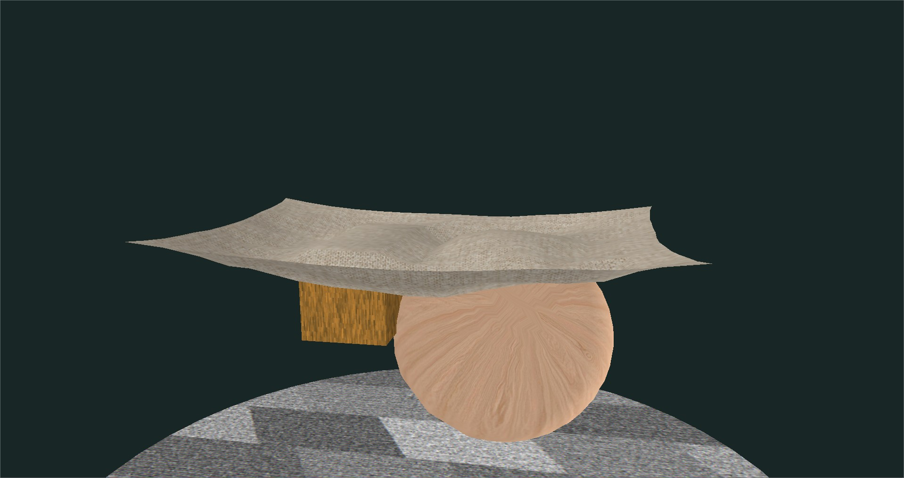
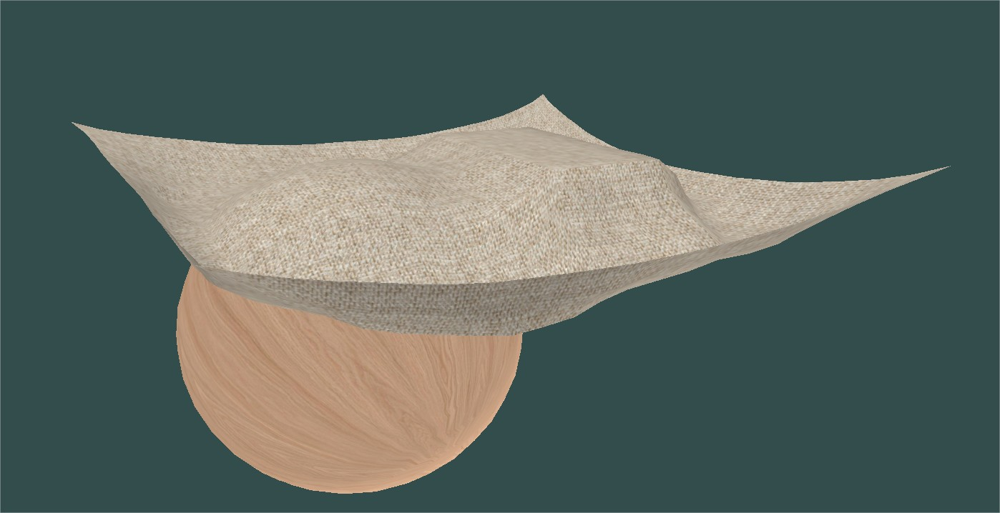

# Drap_Physique
# 🧵 Real-Time Cloth Simulation in C++




## ✨ Project Overview

This application simulates a **realistic cloth** using a mass-spring system and modern C++ techniques. The cloth interacts with various shapes (spheres, boxes, cylinders, cones, disks) and responds to forces such as gravity, wind, and user interaction. It is optimized using a **Structure of Arrays (SoA)** memory layout and supports **multi-threading via OpenMP** for improved performance at high resolutions.

## 🛠️ Technical Highlights

- **Real-time simulation** of a cloth with Verlet integration.
- **SoA-based architecture** for efficient memory access.
- **Parallel computation** using OpenMP (self-collision, forces, wind).
- **Interactive camera** and mouse grabbing of cloth vertices.
- **Command console** to control runtime behavior.
- **.obj export per frame** to generate animations (for Blender, etc).
- **Modular design** for geometry: spheres, boxes, cones, disks, cylinders.
- **Dynamic lighting** with configurable ambient/diffuse/specular.
- **Configurable via JSON** (for tuning cloth properties, forces, etc.).

## 📁 Project Structure

```
├── src/
│ ├── Drap_Physique.cpp # Main entry point
│ ├── command_console.h # Runtime CLI commands
│ ├── export_obj_frame.h # OBJ exporter
│ ├── physicSoA.h # Physics and force handling
│ ├── tissuSoA.h # Cloth representation (SoA)
│ ├── light.h # Light configuration
│ ├── glencapsulation.h # OpenGL utility wrapper
│ ├── ...
├── config.json # Simulation parameters
├── recording/ # Output OBJ frames
├── shaders/ # Vertex and fragment shaders
```

---

## ⚙️ Build Instructions

### ✅ Requirements

- C++17
- [GLFW](https://www.glfw.org/)
- [GLAD](https://glad.dav1d.de/)
- [GLM](https://github.com/g-truc/glm)
- OpenMP (enabled in your compiler)
- CMake 3.10+

### 🔧 Compile with CMake

```bash
mkdir build && cd build
cmake ..
cmake --build . --config Release
```

If you are using Visual Studio, simply open the CMake project folder and build from there.

## 🧩 Runtime Commands

When the app is running, you can type commands in the console to interact with the simulation in real-time.

### General Commands

| Command                | Description                                  |
|------------------------|----------------------------------------------|
| `resetPos`             | Resets the cloth to its initial position     |
| `pause`                | Toggles the simulation pause state           |
| `pauseCamera`          | Toggles camera movement pause                |
| `exit`                 | Exits the simulation                         |
| `help`                 | Displays this list of available commands     |

### Vertex Fixing Commands

| Command                          | Description                                |
|----------------------------------|--------------------------------------------|
| `lockCorner` / `unlockCorner`    | Locks or unlocks the corners of the cloth  |
| `lockSide` / `unlockSide`        | Locks or unlocks the edges of the cloth    |
| `fixVertex <i> <j>`              | Fixes the vertex at grid position (i, j)   |
| `unlockVertex <i> <j>`           | Unfixes the vertex at grid position (i, j) |

### Feature Toggle Commands

Enable or disable simulation features at runtime.

```text
enable <option>
disable <option>
```
Options:

    Simulation: gravity, tension, collision, selfCollision, wind, grab

    Objects: tissu, sphere, box, cylinder, cone, disk

    Wireframe Rendering: tissuWire, sphereWire, boxWire, cylinderWire, coneWire, diskWire

### Recording Commands

| Command                          | Description                                |
|----------------------------------|--------------------------------------------|
| `startRecording`                 | Locks or unlocks the corners of the cloth  |
| `stopRecording`                  | Locks or unlocks the edges of the cloth    |
| `deleteRecords`                  | Fixes the vertex at grid position (i, j)   |

## ⚙️ Configurable Parameters (config.json)

You can adjust physical behavior and simulation settings via config.json.
```{
  "gravity": 9.81,
  "windDirection": [1.0, 0.0, 0.0],
  "windStrength": 3.0,
  "clothResolution": [40, 40],
  "clothSize": [4.0, 4.0],
  "selfCollision": true,
  "windOscillation": true,
  ...
}
```

## 🧵 Simulation Features

Feature	Description
Cloth-grabbing	Click + drag vertex via raycast
Self-collision	Cloth can't pass through itself (via spatial hashing + OpenMP)
Wind oscillation	Periodic wind force
Export OBJ	Write frames for Blender animation
Camera	Smooth orbital camera with mouse control
Light system	Configurable ambient/diffuse/specular values

## 📦 Export to Blender

To visualize your simulation in Blender:

Record frames:
Run startRecording in the console.

Use this Blender script to import .obj per frame:

```import bpy
import os

folder = "C:/path/to/recording/"
frames = sorted([f for f in os.listdir(folder) if f.endswith(".obj")])

for i, file in enumerate(frames):
    bpy.ops.import_scene.obj(filepath=os.path.join(folder, file))
    obj = bpy.context.selected_objects[0]
    obj.hide_render = False
    obj.hide_viewport = False
    obj.keyframe_insert(data_path="location", frame=i + 1)
```

## 🔮 Possible Extensions

    GPU compute shaders for physics

    Soft body integration

    Texture mapping (PBR)

    Scene serialization/loading

    GUI integration with ImGui

## 🧠 Author & License

Created by [YourNameHere].
Free for educational and non-commercial use.
License: MIT

## 🖼️ Screenshots

